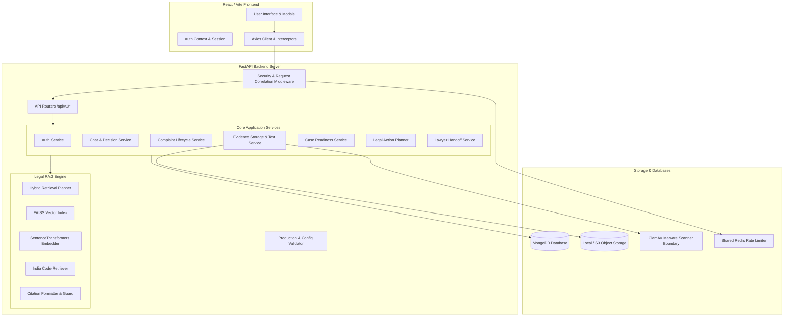
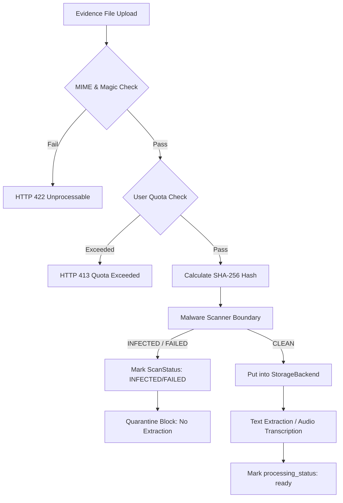

# Nyaya AI — System Architecture & Technical Design

This document details the architecture, component design, data models, legal RAG engine, evidence pipeline, and security controls of **Nyaya AI**.

---

## 1. System Overview

Nyaya AI is built as a decoupled client-server web application:

- **Client**: Single Page Application (SPA) built with React 18 and Vite 8.
- **API Server**: Asynchronous REST API powered by FastAPI (Python 3.12).
- **Database**: MongoDB for persistent documents (Users, Chats, Messages, Complaints, Evidence Metadata, Lawyer Handoff Packs).
- **Legal RAG Engine**: Vector store using FAISS, local embeddings via `sentence-transformers`, hybrid retrieval planner, and live India Code integration.
- **Evidence Storage**: Abstract `StorageBackend` supporting local filesystem for development/testing and private S3/R2 object storage for production.

---

## 2. High-Level Architecture Diagram



---

## 3. Frontend Architecture

The frontend is constructed using React 18, Vite 8, and Vanilla CSS tokens with Tailwind CSS utility classes:

- **State & Context Management**: `AuthContext` handles user authentication lifecycle, JWT token persistence in `sessionStorage`, and automatic login/logout state distribution.
- **API Client Layer**: `frontend/src/api/client.js` wraps Axios with request interceptors to automatically attach `Authorization: Bearer <token>` headers and handles standardized API error parsing.
- **Modals & Overlays**:
  - `SourceDetailsModal`: Displays complete statutory legal text and source citations when clicking `[SOURCE_n]` tags.
  - `CaseReadinessModal`: Visualizes completeness metrics, known facts, missing facts, and evidence gaps.
  - `ActionPlanModal`: Displays ordered practical next steps and primary recommended actions.
  - `LawyerHandoffModal`: Displays comprehensive case summary packs with export capabilities.
- **Accessibility & Touch Polish**:
  - Focus trapping inside active modals via custom hooks.
  - Keyboard Escape key modal closing.
  - Visible skip-to-content link for screen readers.
  - Responsive breakpoint adaptations for mobile, tablet, and desktop viewports.

---

## 4. Backend Architecture

The backend follows a layered FastAPI application design:

```text
backend/app/
├── api/             # HTTP Route Handlers (/api/v1/auth, /chat, /complaint, /evidence, etc.)
├── core/            # Configuration, Security Middleware, Logging & Validators
├── db/              # Database connection & index initialization
├── legal/           # Category definitions & legal domain prompts
├── rag/             # Vector retrieval, FAISS index, citation formatting, hybrid planner
├── repositories/    # MongoDB async CRUD persistence wrappers
├── schemas/         # Pydantic request/response validation models
├── services/        # Domain business logic & orchestration
└── storage/         # Pluggable storage abstraction (LocalStorageBackend, S3StorageBackend)
```

### Server-Side Ownership Enforcement
Every protected route extracts the authenticated user ID from the validated JWT Bearer token via `get_current_user`. Database queries explicitly filter resources by `user_id == current_user["_id"]`. Unauthenticated or cross-user requests are rejected at the service/repository boundary with HTTP 401/403/404 errors.

---

## 5. Conversation & Follow-Up Pipeline

```mermaid
flowchart TD
    MsgIn[User Chat Message] --> AuthCheck{Authenticated?}
    AuthCheck -- No --> 401[HTTP 401 Unauthorized]
    AuthCheck -- Yes --> DecEngine[Conversation Decision Engine]
    
    DecEngine --> CatCheck{Supported Category?}
    CatCheck -- No --> Refuse[Return Category Refusal]
    CatCheck -- Yes --> ClarifyCheck{Missing Critical Facts?}
    
    ClarifyCheck -- Yes --> AskFollowUp[Generate Single Clarifying Question]
    ClarifyCheck -- No --> RAGPath[Trigger RAG Answer Generation]
    
    RAGPath --> Retrieval[FAISS + India Code Retrieval]
    Retrieval --> CitationFmt[Format [SOURCE_n] Citations]
    CitationFmt --> Answer[Return Grounded Legal Answer]
```

### Decision Engine States
1. `ASK_FOLLOW_UP`: Asks 1 specific clarifying question to resolve missing facts (e.g. date of incident, employer name, fee receipt).
2. `ANSWER`: Generates a fully citation-grounded response once core facts are established.
3. `REFUSE_UNSUPPORTED`: Safely refuses queries falling outside the 5 supported legal categories.

---

## 6. Legal RAG & Citation Model

### Dual-Citation Isolation Model
To prevent LLM hallucination and ensure strict separation between authoritative law and user claims:
- **Statutory Law Citations**: Tagged as `[SOURCE_n]` referencing verified legal statutes (e.g., *Section 35, Consumer Protection Act 2019*).
- **User Evidence Citations**: Tagged as `[EVIDENCE_n]` referencing verified user-uploaded evidence items.

```text
User Facts & Evidence [EVIDENCE_1] ---> User Allegation
Authoritative Legal Statutes [SOURCE_1] ---> Governing Legal Rule
```

### Retrieval Modes
- `LOCAL_ONLY`: Searches curated local FAISS vector index of verified Indian statutes.
- `HYBRID`: Combines local FAISS vector retrieval with live India Code DSpace API lookups.
- `LIVE_VERIFY`: Verifies local statutory text against live India Code digital repositories.

### Fail-Closed Safeguards
If statutory legal retrieval confidence falls below threshold or no verified legal sources match the query, the backend returns a safe fallback response stating that authoritative statutory material could not be retrieved, avoiding fabricated sections or deadlines.

---

## 7. Evidence Pipeline & Storage Architecture



### Storage Backend Abstraction
- `LocalStorageBackend`: Used in local development and testing (`uploads/evidence/<user_id>/<file_id>`).
- `S3StorageBackend`: Used in production architecture. Generates user-isolated object keys (`users/<user_id>/evidence/<file_id>/original`), supports configurable Server-Side Encryption (`AES256` or `none` for Cloudflare R2), and provides short-lived signed URLs (TTL: 300s).

---

## 8. Security Controls & Boundaries

| Security Domain | Implementation |
| :--- | :--- |
| **Authentication** | OAuth2 Bearer JWT (HS256) with 30-minute expiration & bcrypt password hashing |
| **Authorization** | Strict server-side ownership checks (`user_id == current_user["_id"]`) |
| **Data Privacy** | All evidence, transcripts, chat history, and complaints are private per user |
| **Integrity** | SHA-256 hash calculated on upload and re-verified before streaming file content |
| **Rate Limiting** | Sliding-window rate limiter abstraction (`InMemoryRateLimiterBackend` / `RedisRateLimiterBackend`) |
| **Input Validation** | Pydantic strict schemas, control-character stripping, path-traversal blocking (`../` rejection) |
| **HTTP Hardening** | `X-Content-Type-Options: nosniff`, `X-Frame-Options: DENY`, `Permissions-Policy` |
| **Cache Protection** | `Cache-Control: no-store, private` and `Vary: Authorization` on all private API endpoints |
| **Request Correlation** | Automatic `X-Request-ID` generation & log propagation |
| **Production Validator** | Fails startup fast if JWT secret is weak/default, CORS is wildcard, or storage is unsafe |

---

## 9. Data Model & Entity Relationships

```text
User (1)
  ├── ChatSession (N)
  │     └── ChatMessage (N)
  ├── Complaint (N)
  │     └── Linked Evidence IDs (N)
  ├── EvidenceRecord (N)
  │     ├── File Metadata & SHA-256
  │     ├── ScanStatus (CLEAN / INFECTED / SCAN_FAILED / NOT_SCANNED)
  │     └── Extracted Text / Transcript
  └── LawyerHandoff (N)
        └── Export History (PDF / DOCX)
```

---

## 10. Prepared Production Architecture

Nyaya AI includes full production deployment preparation:

- **Docker Containers**: `Dockerfile.backend` (multi-stage Python 3.12-slim, non-root user) and `Dockerfile.frontend` (multi-stage Nginx alpine with SPA route rewrites).
- **Orchestration**: `docker-compose.yml` (production topology) and `docker-compose.staging.yml` (staging topology).
- **Render Blueprint**: `render.yaml` defining Render Web Service (`nyaya-ai-api-staging`), Static Site (`nyaya-ai-staging`), Key Value Valkey store (`nyaya-ai-rate-limit-staging`), and ClamAV Private Service (`nyaya-ai-clamav-staging`).
- **CI/CD**: `.github/workflows/ci.yml` quality gate workflow enforcing backend pytest, compileall, pip check, frontend build, RAG 60-scenario evaluation, and Playwright critical E2E smoke tests.

*Note: Live cloud deployment is intentionally skipped for this local/demo project baseline.*
